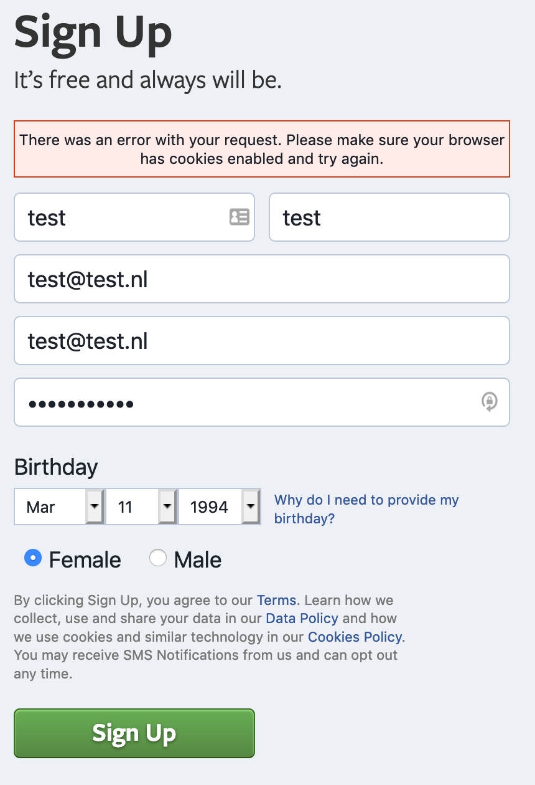

# Browser technologies

In this class I will tackle different aspects of creating a strong, unbreakable product that's accessible to (almost) everyone.

## Research

The subjects I was assigned to existed out of doing research into cookies and network performance.  
During the first week of this subject I will research the subjects and create a better understanding.

## Everyone likes cookies right?

Cookies are small bits of data that can have positive and negative effects on your website when connected to the internet. Cookies work mostly without you noticing that the cookies are at work. However, after a while cookies stack up and the consequences might be more noticeable.

### The two types of cookies:

**Session cookies:**  
Only active when visiting the website and are deleted when closing the browser. These cookies do not collect data from your computer but do store information relevant to the visit.

**Persistent cookies:**  
These cookies are stored in the browser and also known as permanent cookies and only get deleted when you do it manually. The persistent cookies do have an expiry date, but that can take years.

**Pros of persistent cookies:**  
Cookies can help save page data so that when you visit it the next time the page loads quicker.

**Cons of persistent cookies:**  
The data that has been gathered, while not having bad effects, can stack up and leading to slow internet performance. Deleting these cookies will lead to faster internet but loading pages will be taking longer due to the cookies being deleted.

### Influence of cookies:

**Good:**  
The influence of cookies can be seen in sites you visit frequently like your bank or email websites. Cookies help to make the content more personal to your use. Maybe the site gives you questions and based on the answer, that is being stored as a cookie, the next visit the content you're seeing is more personal based on your question. In this case, the cookie helps save information to improve your overall experience.

An example of this is that cookies can remeber filled in information in forms so you don't have to the next time you visit the website.

**Bad:**  
The downside of cookies is that sometimes it can contain malicious spyware to help ads gather personal information. You may not notice this at first but this results in more personalized ads and ways to interact with you more effectively. Third parties like Google and Facebook are known for doing this.

The third parties are gathering every website you visit and determine your interests for ads, other users or even the government through cookies.

There are known issues with cookies in some browsers where through cookies the developer of the website/cookie gained access to personal information like email, passwords and even credit card information. Very serious information can be gained through cookies,

### How does the web behave when you're on a diet and decline the cookies?

Let's start to test a few big players in the game and see what the effects will be when blocking their cookies.

**First of, let's tackle Netflix.**  
When blocking the cookies on netflix, the homepage will load without any problems. The problem comes when clicking on any of the 'start free trial', 'sign in' and 'sign up' buttons. You will be shown an error page ironacly called by netflix as 'entrytrap'.
The message contains the message: 'Cookies please, it looks like your browsers does not accept cookies'.

**How does Facebook handle my diet?**
Well besides showing me the homepage, they don't. Signing up and logging in both give the error page that they need cookies before you can continue.  
It's not like netflix where you get a complete error page but at facebook the just show a small container with the message: 'Cookies required.'

|                     Sign in error page                     |                     Sign up error page                     |
| :--------------------------------------------------------: | :--------------------------------------------------------: |
|  |  |
