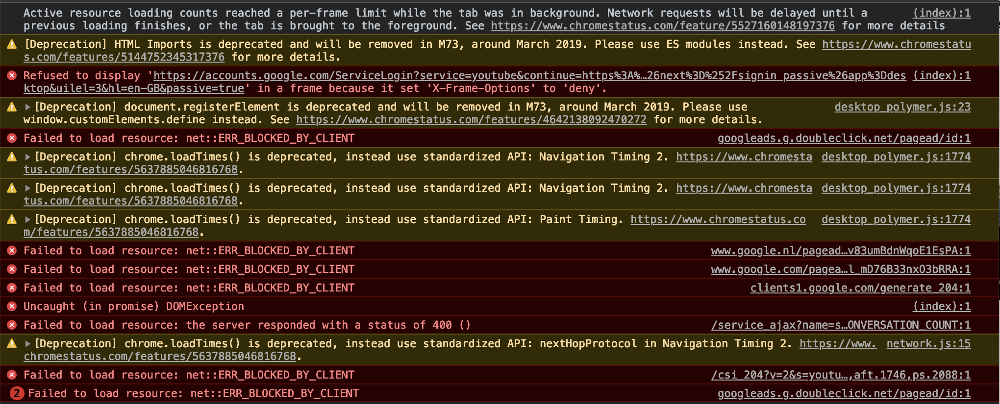
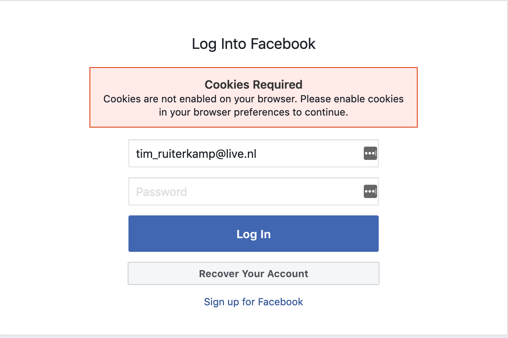
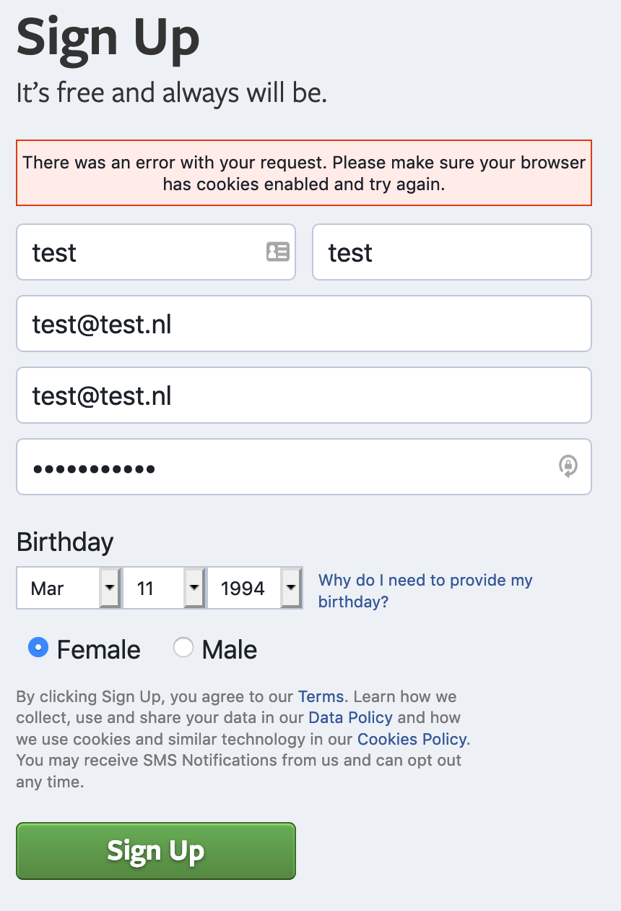
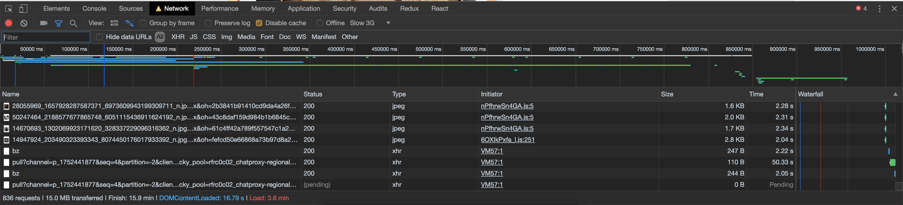
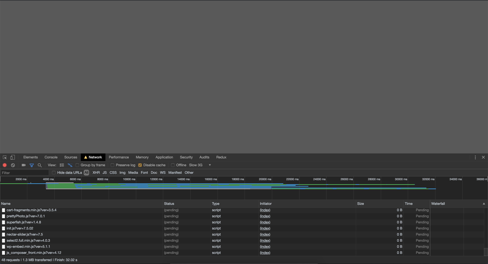
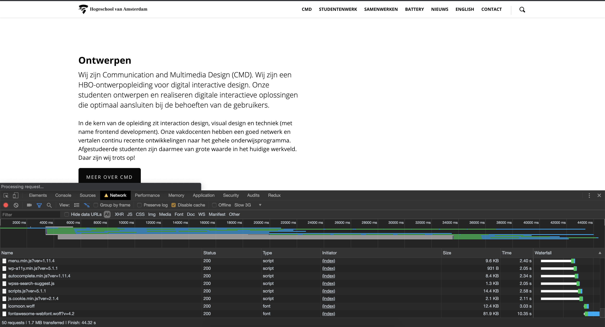
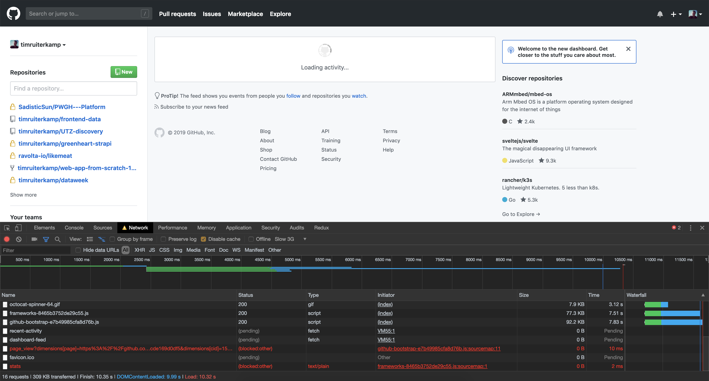
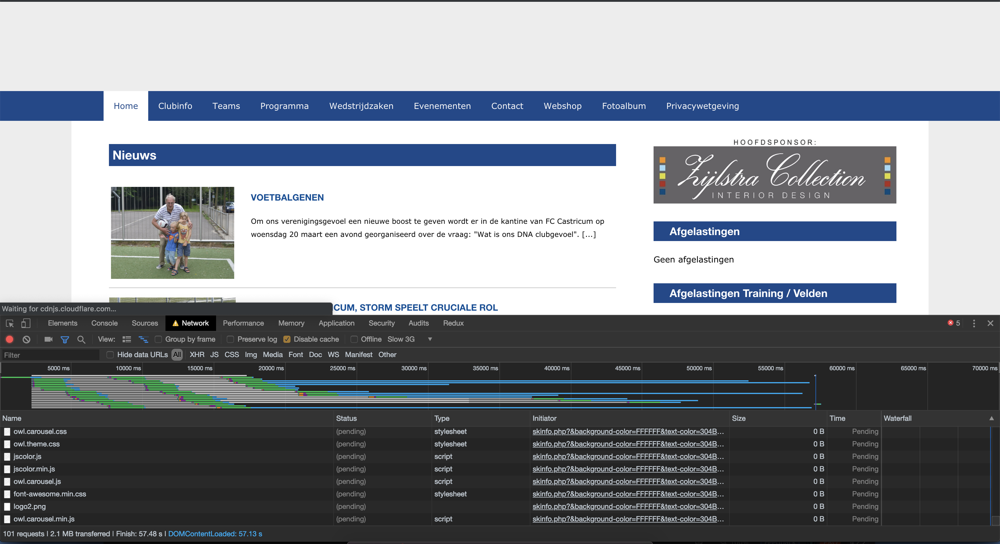
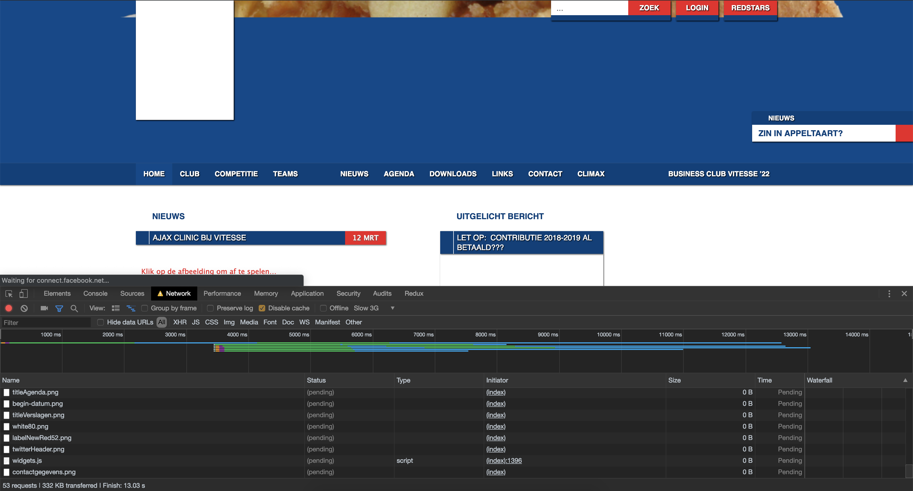

# Browser Technologies

## Research

The subjects I was assigned to existed out of doing research into cookies and network performance.  
During the first week of this subject I will research the subjects and create a better understanding.

## Everyone likes cookies right?

Cookies are small bits of data that can have positive and negative effects on your website when connected to the internet. Cookies work mostly without you noticing that the cookies are at work. However, after a while cookies stack up and the consequences might be more noticeable.

### The two types of cookies:

**Session cookies:**  
Only active when visiting the website and are deleted when closing the browser. These cookies do not collect data from your computer but do store information relevant to the visit.

**Persistent cookies:**  
These cookies are stored in the browser and also known as permanent cookies and only get deleted when you do it manually. The persistent cookies do have an expiry date, but that can take years.

**Pros of persistent cookies:**  
Cookies can help save page data so that when you visit it the next time the page loads quicker.

**Cons of persistent cookies:**  
The data that has been gathered, while not having bad effects, can stack up and leading to slow internet performance. Deleting these cookies will lead to faster internet but loading pages will be taking longer due to the cookies being deleted.

### Influence of cookies:

**Good:**  
The influence of cookies can be seen in sites you visit frequently like your bank or email websites. Cookies help to make the content more personal to your use. Maybe the site gives you questions and based on the answer, that is being stored as a cookie, the next visit the content you're seeing is more personal based on your question. In this case, the cookie helps save information to improve your overall experience.

An example of this is that cookies can remeber filled in information in forms so you don't have to the next time you visit the website.

**Bad:**  
The downside of cookies is that sometimes it can contain malicious spyware to help ads gather personal information. You may not notice this at first but this results in more personalized ads and ways to interact with you more effectively. Third parties like Google and Facebook are known for doing this.

The third parties are gathering every website you visit and determine your interests for ads, other users or even the government through cookies.

There are known issues with cookies in some browsers where through cookies the developer of the website/cookie gained access to personal information like email, passwords and even credit card information. Very serious information can be gained through cookies,

### How does the web behave when you're on a diet and decline the cookies?

Let's start to test a few big players in the game and see what the effects will be when blocking their cookies.

**First of, let's tackle Netflix.**  
When blocking the cookies on netflix, the homepage will load without any problems. The problem comes when clicking on any of the 'start free trial', 'sign in' and 'sign up' buttons. You will be shown an error page ironacly called by netflix as 'entrytrap'.
The message contains the message: 'Cookies please, it looks like your browsers does not accept cookies'.

**How does the other video platform Youtube hold up?**  
When blocking cookies, Youtube automaticly logs you out of their platform. A fun thing I noticed is that I normally use a dark theme for youtube and this is also gone. This will probably be connected to your account. Other than that Youtube generated 10 errors and some warnings when the cookies are blocked. This means that there are a lot of third parties related to the Youtube service

|                     Youtube without cookies                      |                    Youtube errors                    |
| :--------------------------------------------------------------: | :--------------------------------------------------: |
|  |  |

**How does Facebook handle my diet?**  
Well besides showing me the homepage, they don't. Signing up and logging in both give the error page that they need cookies before you can continue.  
It's not like netflix where you get a complete error page but at facebook the just show a small container with the message: 'Cookies required.'

|                      Sign in error page                       |                      Sign up error page                       |
| :-----------------------------------------------------------: | :-----------------------------------------------------------: |
|  |  |

Let's get into some bigger companies withing a 20 mile radius.
The first site I'm going to investigate is AZ.nl.

**Az**  
When visiting the website of AZ without cookies, the first question you get is to accept their cookies. No matter if you have them blocked, the question still exists. After clicking an option you cannot go anywhere since the website doesn't function without cookies.

You can't click on go to the home site, but you can click on the buy tickets button. However, after clicking on the 'buy tickets' the page will freeze and if you click on any element you will be asked to accept cookies again.

**Albert Heijn**  
The homepage of Albert Heijn almost works without any problems. But when you visit the detail page to gather some information of products. 4 Errors will appear and the page is loaded after 1.2 seconds but it will take another 27 seconds before the images and the rest of the content is finally loaded.

|                  Sign in error page                  |                                   Sign up error page                                    |
| :--------------------------------------------------: | :-------------------------------------------------------------------------------------: |
|  |   |

### conclusion

The web is a much slower and less fun place to be when you're ignoring the cookies. Many websites don't work as the probably rely on user information like storage of login name, email and password to make suggestions and connect information.

## Will a tunnel break the web (Bandwidth research)?

In this section I will investigate how websites will respond to very slow internet. Will the websites break, do they show anything or do I just have to wait a very long time. Let's find out.

I'm going to test this on a slow 3G network and see how big and small companies react to it.

First I'm going to test Facebook, as a very big company with many customers all over the globe, they have got to support many connection speeds.

### Facebook

Things I noticed during this test:

- Facebook keeps loading data, even long after everything for the eye is loaded. It even went up to a loading time of 16 minutes  
  -Facebook, althought slow, shows you pure messages and global layout first and after that the profile pictures will be visible and at last the videos and post images. This way you can see some content while waiting for the full page to load.

### Voorhoede

The Voorhoede does some really nice things when handling slow internet.

- Shows the menu bar and the company expertise first
- Then the subtitles and bigger content come in
- At last, images will be showing up.
- Small transfer size, 806kb.
- DomContentLoad and Load took 20.96s and the requests were finished at 27s
- Looks like they made a use of http2 and http, as some requests were loaded async and some in the old waterfall way.

### CMD

CMD is quite optimized if we look at slow internet connections.

- The basic content like text load first
- The other images come after the text
- The header image comes at last
- It takes quite some while for the site to load. It took 1.4 minutes for the DomContent to load and the requests were finished at 1.6 minutes.

|                        After 30s                        |                      After ~ 1 min                      |
| :-----------------------------------------------------: | :-----------------------------------------------------: |
|  |  |

### Github

Github has set their focus on giving you the layout as first with your repositories on the left, discover repositories on the right and in the middle a loading state for the repositories you follow.

- The loading was quite fast,DomContent in 9.99, load on 10.32, the repositories came in between 12-16 seconds and the images were added within 5 seconds after that.But beside this the complete loading of the page only finished after 54.60 seconds, this existed out of slowly loading the other images of the repositories.

### FC Castricum

How does the local football club hold up to slow internet.

- It took more than 50 seconds before something was shown
- They prioritized their layout structure and news items.
- After the layout and content were loaded the header image came in.
- Overall it took 57.13s for the DomContent to load and the loading was finished around 1.3 minutes.
- I found out they loaded 18 external fonts on the website, which took quite some while.

### Vitesse '22 Castricum

How does the rival football club compete.

- The layout was already loaded at 13 seconds
- They are giving feedback in the way they load the global layout first, then the titles and after that the header image
- The last thing to be loaded on the website are the news item images.
- The DomContent was loaded at 31.5 seconds, the load at 1.1 minutes and the complete loading was finished at 1.9 minutes.
- They use a CDN to deliver static content.

### Conclusion

Pages are not really optimized. You see that they are trying to show the most import and least heavy content first, like text and titles. What was good to see, is that at the voorhoede you got a responsive like at least within a 5 second gap on the homepage. If you're already aware about your slow speed, this website gives a very good feedback.
